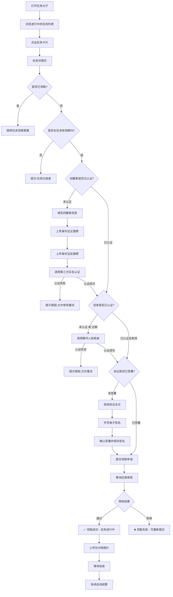
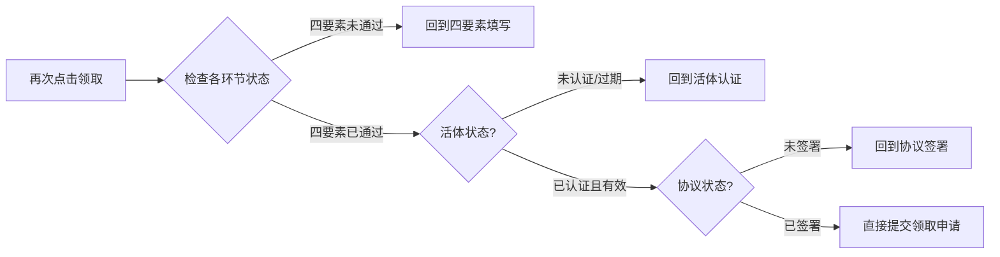
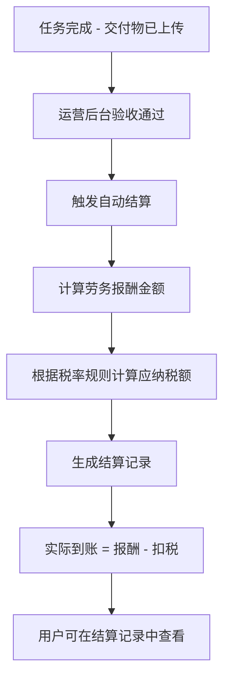

# 任务领取小程序 — 产品需求规格文档

---

## 一、产品定位与目标

### 1.1 项目名称

**任务领取小程序（Provider）**

### 1.2 产品定位

面向自由职业者、灵活就业人员的任务承接平台。用户通过小程序浏览企业发布的任务，完成身份认证、活体核验、协议签署后即可领取任务，完成任务并获得报酬结算。

### 1.3 核心价值

- **高效连接**：打通企业与个体劳动者之间的任务分发渠道
- **安全可信**：四要素实名 + 活体核验 + 电子协议，全链路风控保障
- **透明结算**：系统自动结算，劳务报酬清晰可查，算税功能辅助税务规划
- **轻量便捷**：基于微信小程序生态，无需下载安装，即开即用

### 1.4 设计原则

- **暖黄活力**：金黄色渐变头部 + 白色卡片，传递活力与信任感
- **白色卡片**：纯白圆角大卡片 + 柔和阴影，清晰的信息层级
- **移动优先**：适配手机屏幕，操作区域符合拇指热区
- **渐进式引导**：复杂流程拆分为步骤式表单，降低认知负担
- **状态可见**：每个关键节点均有明确的状态反馈和进度提示

---

## 二、目标用户

### 2.1 核心用户画像

| 维度 | 描述 |
|------|------|
| 年龄 | 18-55岁，以25-40岁为主力人群 |
| 职业 | 自由职业者、兼职人员、灵活就业者、学生、家庭主妇等 |
| 地域 | 全国范围，一二线城市为主 |
| 核心诉求 | 利用空闲时间获取额外收入，流程简单快捷，到账可预期 |

### 2.2 使用场景

| 场景 | 描述 |
|------|------|
| 日常浏览 | 打开小程序浏览当前可领取的任务 |
| 首次领取 | 新用户完成四要素收集 → 活体认证 → 协议签署 → 领取第一个任务 |
| 任务管理 | 查看已领取任务的进度状态，上传交付物 |
| 结算查询 | 月底查看收入明细和纳税情况 |
| 续期认证 | 活体认证180天到期后，单独重新认证 |

### 2.3 用户角色权限

| 角色 | 权限说明 |
|------|---------|
| 普通用户 | 浏览任务、领取任务、管理个人信息、查询结算、算税、查看帮助 |
| 运营人员（后台） | 发布任务、审核领取申请、管理协议模板（不在本小程序范围内） |

---

## 三、核心功能需求

### 3.1 功能模块总览

```
┌─────────────────────────────────────────────────────┐
│                   任务领取小程序                      │
├──────┬──────┬──────┬───────────┬───────────┬────────┤
│ 任务  │ 认证  │ 协议  │   个人    │   支持    │ 管理   │
│ 大厅  │ 流程  │ 签署  │   中心    │   服务    │        │
├──────┼──────┼──────┼───────────┼───────────┼────────┤
│•任务  │•四要素│•签署  │•个人     │•结算     │•任务   │
│ 大厅  │ 收集  │ 协议  │ 信息     │ 记录     │ 领取   │
│•领取  │•活体  │•协议  │•算税     │•帮助     │ 管理   │
│ 任务  │ 认证  │ 管理  │ 计算     │ 中心     │        │
│      │•单独  │       │           │           │        │
│      │ 活体  │       │           │           │        │
└──────┴──────┴──────┴───────────┴───────────┴────────┘
```

### 3.2 各模块功能清单

#### 模块一：任务大厅

| 编号 | 功能点 | 优先级 | 说明 |
|------|--------|-------|------|
| F01-001 | 任务列表展示 | P0 | 仅展示状态为"进行中"的任务 |
| F01-002 | 下拉刷新 | P0 | 刷新最新任务列表 |
| F01-003 | 上拉加载更多 | P0 | 分页加载，每页10条 |
| F01-004 | 任务卡片信息 | P0 | 展示：任务名称、发布企业（脱敏）、收费标准、发布时间、报名领取按钮 |
| F01-005 | 点击进入详情 | P0 | 跳转至任务详情/领取页面 |

#### 模块二：领取任务（完整认证流程）

| 编号 | 功能点 | 优先级 | 说明 |
|------|--------|-------|------|
| F02-001 | 任务详情展示 | P0 | 展示全部任务字段信息 |
| F02-002 | 领取资格校验 | P0 | 校验是否已领取、是否在任务时间内 |
| F02-003 | 四要素信息收集 | P0 | 姓名、身份证号、银行卡号、手机号 + 身份证正反面照片上传 |
| F02-004 | 四要素实名认证 | P0 | 调用第三方实名认证服务接口验证 |
| F02-005 | 活体人脸认证 | P0 | 调用腾讯人脸核身接口 |
| F02-006 | 活体过期检测 | P0 | 检测距上次认证是否超过180天 |
| F02-007 | 协议内容展示 | P0 | 富文本展示当前生效的协议内容 |
| F02-008 | 手写电子签名 | P0 | Canvas手写画布，支持清除重写 |
| F02-009 | 签名图片保存 | P0 | 将签名保存为图片存入云存储 |
| F02-010 | 提交领取申请 | P0 | 整合所有认证材料提交审核 |
| F02-011 | 断点续领 | P1 | 已完成环节跳过，从断点继续 |
| F02-012 | 进度条提示 | P1 | 可视化显示当前所处阶段 |

#### 模块三：任务领取管理

| 编号 | 功能点 | 优先级 | 说明 |
|------|--------|-------|------|
| F03-001 | 已领取任务列表 | P0 | 展示用户所有领取记录 |
| F03-002 | 状态筛选 | P0 | 审核中 / 进行中 / 已完成 / 已结算 / 审核拒绝 |
| F03-003 | 领取进度展示 | P0 | 显示各认证环节完成状态 |
| F03-004 | 交付物上传 | P0 | 上传任务完成的交付物图片 |
| F03-005 | 审核拒绝重新提交 | P1 | 被拒后可修正后重新提交 |

#### 模块四：个人信息查看

| 编号 | 功能点 | 优先级 | 说明 |
|------|--------|-------|------|
| F04-001 | 个人基本信息展示 | P0 | 姓名、身份证号（脱敏）、手机号（脱敏）、银行卡号（脱敏）、开户银行 |
| F04-002 | 认证状态总览 | P0 | 四要素/活体/协议三项认证状态及有效期 |
| F04-003 | 身份证照片查看 | P1 | 查看已上传的身份证正反面（仅本人可见） |
| F04-004 | 个人信息编辑 | P1 | 未认证状态下可修改个人信息 |

#### 模块五：结算记录查询

| 编号 | 功能点 | 优先级 | 说明 |
|------|--------|-------|------|
| F05-001 | 结算记录列表 | P0 | 按时间倒序展示所有结算记录 |
| F05-002 | 结算明细 | P0 | 任务名称、报酬金额、扣税金额、实际到账金额 |
| F05-003 | 结算状态标识 | P0 | 待结算 / 已结算 |
| F05-004 | 月度汇总 | P1 | 按月统计总收入、总扣税、总到手 |

#### 模块六：算税功能

| 编号 | 功能点 | 优先级 | 说明 |
|------|--------|-------|------|
| F06-001 | 输入报酬金额 | P0 | 数字键盘输入劳务报酬金额 |
| F06-002 | 税额自动计算 | P0 | 按国家劳务报酬所得税规则计算 |
| F06-003 | 计算结果展示 | P0 | 税前收入、应纳税额、税后收入明细 |
| F06-004 | 税率规则说明 | P1 | 展示税率阶梯及计算公式 |

#### 模块七：帮助中心

| 编号 | 功能点 | 优先级 | 说明 |
|------|--------|-------|------|
| F07-001 | 帮助文章列表 | P0 | 分类展示常见问题和使用指引 |
| F07-002 | 文章搜索 | P1 | 关键词搜索帮助内容 |
| F07-003 | 文章详情 | P0 | 富文本展示帮助文章内容 |

#### 模块八：协议签署管理

| 编号 | 功能点 | 优先级 | 说明 |
|------|--------|-------|------|
| F08-001 | 已签署协议列表 | P0 | 展示用户所有签署过的协议 |
| F08-002 | 签署详情查看 | P0 | 协议内容 + 签名图片 + 签署时间 |
| F08-003 | 重新签署入口 | P1 | 当协议版本更新时支持重新签署 |

#### 模块九：单独活体认证

| 编号 | 功能点 | 优先级 | 说明 |
|------|--------|-------|------|
| F09-001 | 活体状态检测 | P0 | 检测当前活体是否有效或已过期 |
| F09-002 | 活体过期提醒 | P0 | 过期前7天开始提醒用户 |
| F09-003 | 发起活体认证 | P0 | 调用腾讯人脸核身接口 |
| F09-004 | 认证结果反馈 | P0 | 成功后更新有效期为当前时间+180天 |

### 3.3 核心业务流程图

#### 3.3.1 任务领取主流程



#### 3.3.2 断点续领流程



#### 3.3.3 结算流程



### 3.4 业务规则定义

#### 3.4.1 任务状态规则

| 状态值 | 状态名称 | 说明 |
|--------|---------|------|
| 0 | 未发布 | 运营创建但未发布，不可见 |
| 1 | 进行中 | 当前时间在起止时间范围内，可被领取 |
| 2 | 已结束 | 超过任务结束时间或名额已满 |

**展示规则**：任务大厅只展示 `status=1` 且当前时间在 `[startDate, endDate]` 范围内的任务。

#### 3.4.2 领取记录状态规则

| 状态值 | 状态名称 | 说明 |
|--------|---------|------|
| 0 | 审核中 | 已提交领取申请，等待运营审核 |
| 1 | 进行中 | 审核通过，任务执行中 |
| 2 | 已完成 | 交付物已上传，待结算 |
| 3 | 已结算 | 结算已完成 |
| 4 | 审核拒绝 | 审核不通过，可修正后重新提交 |

**状态流转**：

```
审核中(0) ──→ 进行中(1) ──→ 已完成(2) ──→ 已结算(3)
   │              ↑
   │              │ (上传交付物)
   ↓              │
 审核拒绝(4) ────┘ (重新提交)
```

#### 3.4.3 活体认证规则

| 规则项 | 定义 |
|--------|------|
| 有效期 | 认证通过之日起 **180个自然日** |
| 过期判定 | `当前日期 > livenessExpireDate` 则视为过期 |
| 过期影响 | 无法继续领取新任务，需重新认证 |
| 单独认证 | 活体过期后可通过「单独活体」页面独立完成认证 |
| 到期提醒 | 过期前7天每次打开小程序时弹出提醒 |

#### 3.4.4 劳务报酬税率规则

根据《个人所得税法》劳务报酬所得预扣预缴规定：

| 收入区间 | 计算方式 | 税率 | 速算扣除数 |
|---------|---------|------|----------|
| ≤800元 | 免税 | 0% | 0 |
| 800元 < 收入 ≤ 4000元 | (收入 - 800) × 20% | 20% | 0 |
| >4000元 | 收入 × (1 - 20%) × 税率 - 速算扣除数 | 见下表 | 见下表 |

**超过4000元的税率分段**：

| 应纳税所得额 | 税率 | 速算扣除数 |
|-------------|------|----------|
| ≤20000元 | 20% | 0 |
| 20000元 ~ 50000元 | 30% | 2000元 |
| >50000元 | 40% | 7000元 |

#### 3.4.5 收费标准规则

| 模式 | 说明 | 展示格式 |
|------|------|------|
| 单价 | 固定单价 × 数量 | `收费标准 · ¥X/件` |
| 比例 | 按交易额比例提成 | `收费标准 · X%` |

#### 3.4.6 数据脱敏规则

| 字段 | 脱敏格式 | 示例 |
|------|---------|------|
| 身份证号 | 前3位****后4位 | 110***********1234 |
| 手机号 | 前3位****后4位 | 138****5678 |
| 银行卡号 | 前4位****后4位 | 6228****8888 |
| 姓名 | 隐藏中间字 | 张*明 |
| 企业名称 | 前2位***后3位 | 腾讯***限公司 |

---

## 四、信息架构与页面结构

### 4.1 全局导航架构

```
┌──────────────────────────────────────────────┐
│           导航栏 (#5A7FA8 冰蓝 + 白字)          │
│  页面标题                                      │
├──────────────────────────────────────────────┤
│              页面内容区域                       │
│          （背景：冰雾渐变色 #ECF0F5）            │
├──────────────────────────────────────────────┤
│          TabBar 底部标签栏 (选中 #D4857B 珊瑚)   │
│  ┌────────┬────────┬────────┐                │
│  │ 🏠首页  │ 📋任务  │ 👤我的  │                │
│  │ 任务大厅 │ 任务管理 │ 个人中心│                │
│  └────────┴────────┴────────┘                │
└──────────────────────────────────────────────┘
```

**TabBar 配置（3个Tab）**：

| 序号 | Tab 名称 | 默认页面 | 包含子页面 |
|------|---------|---------|-----------|
| 1 | 首页 | 任务大厅 | 任务详情、领取流程各页面 |
| 2 | 任务 | 任务领取管理 | - |
| 3 | 我的 | 个人中心 | 个人信息、结算记录、算税、帮助中心、协议管理、单独活体 |

### 4.2 页面路由设计（12个页面）

```
miniprogram/pages/
├── home/index                  # Tab: 任务大厅
├── task-manage/index           # Tab: 任务领取管理
├── mine/index                  # Tab: 个人中心
├── task-detail/index           # 任务详情 & 领取入口
├── identity/index              # 四要素认证
├── liveness/index              # 活体认证（流程内）
├── sign-agreement/index        # 签署协议
├── personal-info/index         # 个人信息详情
├── settlement/index            # 结算记录
├── tax-calc/index              # 算税
├── help/index                  # 帮助中心列表
├── help/detail                 # 帮助文章详情
├── agreement-manage/index      # 协议签署管理
└── liveness-single/index       # 单独活体认证
```

### 4.3 页面跳转关系图

```
                    ┌──────────────┐
                    │   任务大厅     │
                    │  home/index   │
                    └──────┬───────┘
                           │ 点击任务卡片
                           ▼
                    ┌──────────────┐
               ┌──▶│   任务详情     │◀──┐
               │   │task-detail/   │   │
               │   └──────┬───────┘   │
               │          │立即领取    │
               │   ┌──────▼───────┐   │
               │   │  四要素认证    │   │
               │   │ identity/    │   │
               │   └──────┬───────┘   │
               │          │认证通过    │
               │   ┌──────▼───────┐   │
               │   │  活体认证     │   │
               │   │ liveness/   │   │
               │   └──────┬───────┘   │
               │          │认证通过    │
               │   ┌──────▼───────┐   │
               │   │  签署协议     │   │
               │   │sign-agree/   │   │
               │   └──────┬───────┘   │
               │          │签署完成    │
               │   ┌──────▼───────┐   │
               │   │  提交审核     │─┘
               │   └──────────────┘
               │
┌──────────────┐│
│  任务管理Tab  │◀┘
│ task-manage/ │
└──────┬───────┘
       ├──────────────┬──────────────┬──────────────┐
       ▼              ▼              ▼              ▼
 ┌──────────┐  ┌──────────┐  ┌──────────┐  ┌──────────┐
 │个人信息    │  │结算记录   │  │算税功能   │  │帮助中心   │
 │personal-  │  │settle-   │  │tax-calc/ │  │help/     │
 │info/      │  │ment/     │  │          │  │          │
 └──────────┘  └──────────┘  └──────────┘  └────┬─────┘
                                           │
                                   ┌───────▼──────┐
                                   │  帮助文章详情  │
                                   │  help/detail  │
                                   └──────────────┘

┌──────────────────┐  ┌──────────────────┐
│   协议管理        │  │   单独活体认证     │
│agreement-manage/ │  │liveness-single/  │
└──────────────────┘  └──────────────────┘
```

### 4.4 数据库集合设计（10个集合）

#### 集合一：users — 用户信息表

| 字段名 | 类型 | 必填 | 说明 |
|--------|------|------|------|
| `_id` | string | 是 | 记录ID（自动生成） |
| `_openid` | string | 是 | 用户唯一标识 |
| `name` | string | 是 | 姓名 |
| `idCard` | string | 是 | 身份证号 |
| `bankCard` | string | 是 | 银行卡号 |
| `phone` | string | 是 | 手机号 |
| `bankName` | string | 否 | 开户银行名称 |
| `idCardFrontUrl` | string | 否 | 身份证正面照片云存储路径 |
| `idCardBackUrl` | string | 否 | 身份证反面照片云存储路径 |
| `identityVerified` | boolean | 是 | 四要素认证状态 |
| `identityTime` | date | 否 | 四要素认证时间 |
| `livenessVerified` | boolean | 是 | 活体认证状态 |
| `livenessDate` | date | 否 | 最近一次活体认证时间 |
| `livenessExpireDate` | date | 否 | 活体过期时间（认证日+180天） |
| `createTime` | date | 是 | 创建时间 |
| `updateTime` | date | 是 | 更新时间 |

#### 集合二：tasks — 任务表

| 字段名 | 类型 | 必填 | 说明 |
|--------|------|------|------|
| `_id` | string | 是 | 任务ID（自动生成） |
| `title` | string | 是 | 任务名称 |
| `description` | string | 是 | 任务描述 |
| `deliveryStandard` | string | 是 | 交付标准说明（如：上传至少5张标注完成的截图） |
| `enterpriseName` | string | 是 | 发布企业名称 |
| `payMode` | integer | 是 | 付费模式：1-单价，2-比例 |
| `unitPrice` | number | 否 | 单价（payMode=1时必填） |
| `commissionRate` | number | 否 | 佣金比例百分比（payMode=2时必填） |
| `totalQuota` | integer | 是 | 总名额 |
| `claimedQuota` | integer | 是 | 已领取名额（默认0） |
| `status` | integer | 是 | 状态：0-未发布，1-进行中，2-已结束 |
| `startDate` | date | 是 | 开始时间 |
| `endDate` | date | 是 | 结束时间 |
| `requirements` | array | 否 | 硬性要求列表（如：['年满18周岁','完成实名认证']） |
| `requirementDescription` | string | 否 | 硬性描述（详细说明硬性要求的执行标准、处罚措施等） |
| `coverImage` | string | 否 | 封面图云存储路径 |
| `createTime` | date | 是 | 创建时间 |
| `updateTime` | date | 是 | 更新时间 |

#### 集合三：task_claims — 任务领取记录表（核心流转表）

| 字段名 | 类型 | 必填 | 说明 |
|--------|------|------|------|
| `_id` | string | 是 | 领取记录ID |
| `_openid` | string | 是 | 用户openid |
| `taskId` | string | 是 | 关联任务ID |
| `taskTitle` | string | 是 | 任务标题（冗余存储） |
| `reward` | number | 是 | 该次领取预估报酬（总金额） |
| `rewardCount` | number | 否 | 预估完成件数（用于展示报酬明细） |
| `unitPrice` | number | 否 | 任务单价（冗余，便于展示单价×数量） |
| `payMode` | integer | 否 | 任务付费模式（冗余）：1-单价，2-比例 |
| `commissionRate` | number | 否 | 佣金比例（payMode=2时冗余存储） |
| `status` | integer | 是 | 0-审核中，1-进行中，2-已完成，3-已结算，4-审核拒绝 |
| `identityStatus` | integer | 是 | 四要素状态：0-未认证，1-已认证 |
| `livenessStatus` | integer | 是 | 活体状态：0-未认证，1-已认证，2-已过期 |
| `agreementStatus` | integer | 是 | 协议状态：0-未签署，1-已签署 |
| `deliveryUrls` | array | 否 | 交付物图片URL数组 |
| `auditRemark` | string | 否 | 审核备注（含拒绝原因） |
| `submitTime` | date | 否 | 提交审核时间 |
| `auditTime` | date | 否 | 审核操作时间 |
| `completeTime` | date | 否 | 任务完成时间 |
| `settleTime` | date | 否 | 结算时间 |
| `createTime` | date | 是 | 创建时间 |
| `updateTime` | date | 是 | 更新时间 |

#### 集合四：identity_records — 四要素认证记录表

| 字段名 | 类型 | 必填 | 说明 |
|--------|------|------|------|
| `_id` | string | 是 | 记录ID |
| `_openid` | string | 是 | 用户openid |
| `name` / `idCard` / `bankCard` / `phone` | string | 各是 | 四要素信息 |
| `idCardFrontUrl` / `idCardBackUrl` | string | 各是 | 身份证照片 |
| `verifyResult` | boolean | 是 | 第三方认证结果 |
| `verifyMessage` | string | 否 | 认证返回信息 |
| `thirdPartyOrderId` | string | 否 | 第三方订单号 |
| `createTime` | date | 是 | 认证时间 |

#### 集合五：liveness_records — 活体认证记录表

| 字段名 | 类型 | 必填 | 说明 |
|--------|------|------|------|
| `_id` | string | 是 | 记录ID |
| `_openid` | string | 是 | 用户openid |
| `verifyResult` | boolean | 是 | 腾讯人脸核身结果 |
| `verifyMessage` | string | 否 | 认证返回信息 |
| `sessionId` | string | 否 | 腾讯核身会话标识 |
| `expireDate` | date | 是 | 过期时间（认证日+180天） |
| `source` | string | 否 | 来源：claim(流程内) 或 single(单独) |
| `createTime` | date | 是 | 认证时间 |

#### 集合六：agreements — 协议模板表

| 字段名 | 类型 | 必填 | 说明 |
|--------|------|------|------|
| `_id` | string | 是 | 协议ID |
| `title` | string | 是 | 协议标题 |
| `content` | string | 是 | 协议正文（富文本HTML） |
| `version` | string | 是 | 版本号（如 v1.0.0） |
| `isActive` | boolean | 是 | 是否为当前生效版本 |
| `effectiveDate` | date | 否 | 生效日期 |
| `createTime` | date | 是 | 创建时间 |
| `updateTime` | date | 是 | 更新时间 |

#### 集合七：agreement_signatures — 协议签署记录表

| 字段名 | 类型 | 必填 | 说明 |
|--------|------|------|------|
| `_id` | string | 是 | 签署记录ID |
| `_openid` | string | 是 | 用户openid |
| `agreementId` | string | 是 | 关联协议ID |
| `agreementTitle` | string | 是 | 协议标题（冗余） |
| `agreementVersion` | string | 是 | 签署时的协议版本 |
| `signatureUrl` | string | 是 | 手写签名图片云存储路径 |
| `signTime` | date | 是 | 签署时间 |

#### 集合八：settlements — 结算记录表

| 字段名 | 类型 | 必填 | 说明 |
|--------|------|------|------|
| `_id` | string | 是 | 结算ID |
| `_openid` | string | 是 | 用户openid |
| `claimId` | string | 是 | 关联领取记录ID |
| `taskId` | string | 是 | 关联任务ID |
| `taskTitle` | string | 是 | 任务标题（冗余） |
| `reward` | number | 是 | 报酬金额 |
| `taxAmount` | number | 是 | 扣税金额 |
| `actualAmount` | number | 是 | 实际到账金额 |
| `taxRate` | number | 否 | 适用税率(%) |
| `status` | integer | 是 | 状态：0-待结算，1-已结算 |
| `settleMonth` | string | 是 | 结算月份（用于月度汇总） |
| `settleTime` | date | 是 | 结算时间 |
| `createTime` | date | 是 | 创建时间 |

#### 集合九：tax_records — 算税记录表

| 字段名 | 类型 | 必填 | 说明 |
|--------|------|------|------|
| `_id` | string | 是 | 记录ID |
| `_openid` | string | 是 | 用户openid |
| `grossIncome` | number | 是 | 税前收入 |
| `taxableAmount` | number | 是 | 应纳税所得额 |
| `taxRate` | number | 是 | 适用税率(%) |
| `quickDeduction` | number | 是 | 速算扣除数 |
| `taxAmount` | number | 是 | 应纳税额 |
| `netIncome` | number | 是 | 税后收入 |
| `calcTime` | date | 是 | 计算时间 |

#### 集合十：help_articles — 帮助文章表

| 字段名 | 类型 | 必填 | 说明 |
|--------|------|------|------|
| `_id` | string | 是 | 文章ID |
| `title` | string | 是 | 文章标题 |
| `category` | string | 是 | 分类：guide(使用指南) / faq(常见问题) / policy(政策说明) |
| `content` | string | 是 | 文章正文（富文本HTML） |
| `sortOrder` | integer | 否 | 排序权重 |
| `isTop` | boolean | 否 | 是否置顶 |
| `viewCount` | integer | 否 | 浏览次数 |
| `createTime` | date | 是 | 创建时间 |
| `updateTime` | date | 是 | 更新时间 |

---

## 五、页面说明

### 5.1 任务大厅 (`pages/home/index`)

**页面类型**：TabBar主页 — 首页Tab  
**设计风格**：暖黄活力 · 黄色渐变头部 · 白色圆角卡片 + 柔和投影

#### 功能点

| 序号 | 功能 | 说明 |
|------|------|------|
| 1 | 品牌横幅 | 冰蓝→紫霞渐变横幅，内含毛玻璃图标（带悬浮投影透视感）+ 标语文字 |
| 2 | 背景装饰层 | 固定定位的三颗冰蓝/紫霞/珊瑚光球，随滚动产生视差位移 |
| 3 | 毛玻璃搜索栏 | 半透明白底 + backdrop-filter blur，聚焦时外发光环 |
| 4 | 任务列表加载 | 自动加载进行中任务 + 查询当前用户领取状态 |
| 5 | 毛玻璃任务卡片 | 半透明磨砂卡片 + 顶部高光线 + 多层蓝调投影，按下微缩反馈 |
| 6 | 领取状态展示 | 未领取：珊瑚渐变按钮（带发光投影）；已领取：薄荷绿半透明徽章 |
| 7 | 硬性条件标签 | 卡片内展示任务硬性要求标签（冰蓝半透明底色 + 边框），快速了解门槛 |
| 8 | 滚动视差 | 背景光球随 scroll 以不同速率偏移 |
| 9 | 下拉刷新 | 刷新最新任务数据 |
| 10 | 上拉加载更多 | 分页加载，每页10条 |
| 11 | 点击跳转详情 | 点击任意卡片跳转任务详情页 |

#### 页面元素

```
┌──────────────────────────────────────┐
│  导航栏: 任务大厅 (黄底黑字)            │
├──────────────────────────────────────┤
│  ┌────────────────────────────────┐  │
│  │ 甄宏晟服务平台                  │  │  ← 黄色渐变背景区
│  │ 专业灵活用工，让工作更自由        │  │
│  │              ┌────────────┐    │  │  ← 白色标语气泡
│  │              │ 专业灵活用工│    │  │
│  │              │ 让工作更自由│    │  │
│  └────────────────────────────────┘  │
│  ┌────────────────────┐  ┌──────┐  │
│  │ 🔍 搜索任务名称     │  │ 搜索 │  │  ← 白色搜索栏+橙色搜索按钮
│  └────────────────────┘  └──────┘  │
│  ┌────────────────────────────────┐  │
│  │▌ 📅 电商图片数据标注 2026-06-08│  │  ← 白色卡片+左侧黄条
│  │   腾讯***限公司                 │  │
│  │   收费标准 · ¥5.00/件 [联系报名]│  │  ← 红色价格+黄色按钮
│  └────────────────────────────────┘  │
│  ┌────────────────────────────────┐  │
│  │▌ 📅 文档格式转换校对 2026-06-05│  │
│  │   金山***限公司                 │  │
│  │   收费标准 · ¥25.00/件 [已领取]│  │  ← 绿色已领取徽章
│  └────────────────────────────────┘  │
│  ─── 加载中 / 已经到底了 ───          │
├──────────────────────────────────────┤
│  [🏠首页]  [📋任务]  [👤我的]         │
└──────────────────────────────────────┘
```

#### 品牌横幅（暖黄款）

- **位置**：页面顶部黄色背景区内
- **背景**：`linear-gradient(180deg, #FFD93D 0%, #FFEB3B 60%, #F5F5F5 100%)`
- **标题**：黑色粗体 `font-size: 40rpx; font-weight: 700; color: #333`
- **副标题**：灰色小字 `font-size: 24rpx; color: #666`
- **标语气泡**：白色圆角卡片 + 小三角尾巴，内含黑色文字

#### 搜索栏

- **外观**：白色圆角卡片，高度 80rpx，圆角 40rpx
- **搜索图标**：左侧 🔍，opacity 0.5
- **搜索按钮**：右侧独立白色圆角按钮，文字橙色 `#FF6B35`
- **阴影**：柔和投影 `0 4rpx 16rpx rgba(0,0,0,0.06)`

#### 任务卡片（白色卡片款）

- **外观**：纯白底 `#FFFFFF`，圆角 24rpx，柔和阴影
- **左侧装饰条**：8rpx 宽黄色渐变条 `linear-gradient(180deg, #FFD93D, #FF8C42)`
- **布局**：左侧黄色条 + 右侧内容区（任务名/企业名/收费模式/日期/按钮）
- **任务名**：黑色粗体 + 📅 小图标
- **日期**：右侧灰色小字
- **收费模式**：红色高亮 `#FF4D4D`
- **未领取按钮**：黄色渐变胶囊 `linear-gradient(135deg, #FFD93D, #FFEB3B)`，黑色文字
- **已领取徽章**：翠绿底色 + 绿色文字

#### 数据映射规则

| 展示字段 | 来源字段 | 处理规则 |
|---------|---------|---------|
| 企业名称 | `enterpriseName` | 前二后三脱敏（如"腾讯***限公司"） |
| 收费标准 | `payMode` + `unitPrice` / `commissionRate` | 按件：`收费标准 · ¥X/件`；按比例：`收费标准 · X%` |
| 发布时间 | `createTime` | 格式化为 `YYYY-MM-DD` |

#### 空状态：无数据时展示空状态插图 + "暂无进行中的任务"；加载中用骨架屏；加载失败显示重试按钮。

---

### 5.2 任务详情 & 领取入口 (`pages/task-detail/index`)

**页面类型**：子页面

#### 功能点

| 序号 | 功能 | 说明 |
|------|------|------|
| 1 | 任务详情展示 | 名称、描述、交付标准、企业、付费模式、时间、硬性要求、硬性描述、技能要求 |
| 2 | 领取按钮 | 点击发起领取流程（从管理页进入时隐藏底部操作栏） |
| 3 | 已领取检测 | 已领取则展示「已在领取中，查看进度」 |
| 4 | 时间有效性判断 | 过期则禁用领取 |
| 5 | **按企业维度认证检查** | 查询该用户在此企业下的认证记录，决定是否免认证 |
| 6 | **同客户免认证** | 三项认证都完成 → 跳过流程直接报名，提示"报名成功" |
| 7 | **换客户重认证** | 新企业无认证记录 → 按序引导 identity→liveness→sign-agreement |
| 8 | **防重复领取** | 提交前二次检查 task_claims，已存在则直接返回成功 |
| 9 | **原子扣减名额** | 使用 `db.command.inc(1)` 防止并发超卖 |
| 10 | **双重过滤查询** | 认证记录按 `_openid + enterpriseName` 查询，防止跨用户数据污染 |

#### 操作流程

```
接收参数taskId → 查询详情 → 渲染 → 点击"立即领取"
       │
       ├─ 已领取？→ Toast"报名成功" → 跳转管理页
       ├─ 已过期？→ Toast"任务已结束"
       ├─ 名额已满？→ Toast"名额已满"
       │
       └─ 通过 → startClaim()
              │
              ├─ 查询该用户+该企业的认证记录（_openid + enterpriseName）
              │    ├─ identity_records (verifyResult=true)
              │    ├─ liveness_records (verifyResult=true + 未过期)
              │    └─ agreement_signatures
              │
              ├─ 三项都完成 → ✅ 同客户免认证 → submitClaim() → "报名成功"
              │
              └─ 有缺失 → 🔄 按序引导：identity → liveness → sign-agreement
```

**同客户 vs 换客户对比**：

| 场景 | 认证状态 | 行为 | 提示 |
|------|---------|------|------|
| 企业A → 再领企业A任务 | 该企业下三项认证均有效 | 跳过认证，直接创建领取记录 | **报名成功** |
| 企业A → 首次领企业B任务 | 企业B下无认证记录 | 完整走 identity→liveness→agreement | 提交成功，等待审核 |
| 活体过期（>180天） | liveness_records.expireDate 超期 | 仅需重新活体认证 | 引导至活体页 |
| 已领取同一任务 | task_claims 已有记录 | 防重复，直接返回 | **报名成功** |

---

### 5.3 四要素认证 (`pages/identity/index`) — 流程第1步(1/3)

#### 功能点

| 序号 | 功能 | 说明 |
|------|------|------|
| 1 | 表单输入 | 姓名、身份证号(18位)、银行卡号(16-19位)、手机号(11位) |
| 2 | 身份证拍照上传 | 正反面各一张，存云存储 |
| 3 | 图片预览与重拍 | 缩略图可删除重拍 |
| 4 | 表单校验 | 必填+格式校验 |
| 5 | 提交认证 | 云函数→第三方实名接口 |
| 6 | 结果处理 | 成功进下一步；失败允许重试 |

---

### 5.4 活体认证 (`pages/liveness/index`) — 流程第2步(2/3)

#### 功能点

- 状态检测（有效/过期）
- 过期醒目提醒
- 引导说明（光线充足、摘遮挡物等）
- 调用腾讯人脸核身SDK
- 成功后记录认证时间和180天有效期

---

### 5.5 签署协议 (`pages/sign-agreement/index`) — 流程第3步(3/3)

#### 功能点

- 富文本渲染当前生效版协议
- 滚动到底部后激活签名按钮（防不看就签）
- Canvas手写签名（笔触 #1A1A2E，线宽4px）
- 清除重签 / 签名导出PNG存云存储
- **防空白签名**：笔画像素占比 < 1% 时拦截
- **防重复提交**：签署前检查 task_claims 是否已存在
- **名额校验**：检查 claimedQuota 是否已满
- **原子扣减名额**：`db.command.inc(1)` 更新 claimedQuota（权限允许时）

---

### 5.6 任务领取管理 (`pages/task-manage/index`) — Tab:任务

#### 功能点

- 领取记录列表，按领取时间倒序展示
- 卡片含任务名、彩色状态标签、**硬性条件标签**、预估报酬（金额×次数）、领取时间
- **硬性条件标签**：批量查询 tasks 表获取 requirements 字段，以冰蓝半透明标签展示
- **点击卡片直接进入任务详情**（fromManage模式，隐藏底部操作按钮）
- 审核拒绝记录支持「重新提交」按钮
- 进行中状态支持「上传交付物」按钮
- 空状态引导去任务大厅

**状态标签配色**：

| 状态 | 背景 | 文字 |
|------|------|------|
| 审核中 | #FFF3CD | #856404 |
| 进行中 | #CCE5FF | #004085 |
| 已完成 | #D4EDDA | #155724 |
| 已结算 | #D1ECF1 | #0C5460 |
| 审核拒绝 | #F8D7DA | #721c24 |

---

### 5.7 个人信息 (`pages/personal-info/index`)

- 展示脱敏信息（姓名、身份证、手机号、银行卡、开户银行）
- 身份证照片大图预览
- 三项认证状态面板 + 活体倒计时天数
- 未认证时可编辑，已认证仅查看

---

### 5.8 结算记录 (`pages/settlement/index`)

- 月度汇总卡（总收入/总扣税/实际到手）+月份切换
- 明细列表：任务名、报酬、扣税、实发、结算日期
- 待结算 vs 已结算视觉区分

---

### 5.9 算税功能 (`pages/tax-calc/index`)

- 数字键盘输入金额，实时计算
- 结果分栏：税前/税率/应纳税额/税后
- 可展开税率阶梯表说明
- 本地缓存最近计算历史

**计算逻辑**：
```
≤800元 → 免税
800~4000元 → (收入-800)×20%
>4000元 → 收入×80%×税率-速算扣除:
  ≤20000部分:20%, 20000-50000部分:30%(扣2000), >50000部分:40%(扣7000)
```

---

### 5.10 帮助中心 (`pages/help/index` & `/detail`)

- 列表页：分类Tab（全部/指南/FAQ/政策）、搜索、置顶标记
- 详情页：富文本正文 + 相关推荐

---

### 5.11 协议签署管理 (`pages/agreement-manage/index`)

- 已签署协议列表，每项含标题/版本/签署时间/查看入口
- 详情查看协议内容+签名图片
- 有新版本时提示重新签署
- **协议模板不含报酬结算条款**

---

### 5.12 单独活体认证 (`pages/liveness-single/index`)

三种状态UI：
- **有效**：✅ 认证有效，剩余N天 [重新认证(可选)]
- **即将过期≤7天**：⚠️ 即将过期提醒 [立即认证]
- **已过期**：❌ 已于XX日过期，无法领取新任务 [立即认证]

---

### 5.13 个人中心 — "我的" (`pages/mine/index`) — Tab:我的

- **顶部黄色背景区**：`linear-gradient(180deg, #FFD93D 0%, #FFEB3B 70%, #F5F5F5 100%)`，底部圆角过渡
- **用户信息**：左侧圆形头像（白边）+ 右侧黑色姓名 + 灰色手机号
- **收入统计卡**：白色大圆角卡片（24rpx），悬浮于黄色背景之上
  - "总收入（元）"标签 + 大号红色数字
  - 下方两个灰色底小卡片：结算笔数 / 进行中的任务
- **功能菜单：白色卡片内 4 列网格**
  - 6 个菜单项，每行 4 个，自动换行
  - 每个项含橙色浅底圆形图标 + 菜单标题
  - 点击均可查看详情：
    | 菜单项 | 点击行为 |
    |--------|---------|
    | 个人信息 | 进入个人信息详情页 |
    | 结算记录 | 进入结算记录页 |
    | 协议管理 | 进入协议管理列表页 |
    | 税费计算 | 进入算税页 |
    | 活体认证 | 进入活体认证详情页 |
    | 帮助中心 | 进入帮助中心页 |
- **安全退出**：黄色渐变大胶囊按钮，底部居中
- 活体即将过期时顶部横幅提醒

---

## 六、UI配色与视觉规范

### 6.1 色彩体系

#### 主色调（暖黄活力 · 白色卡片）

| 色彩名称 | 色值 | 用途 |
|---------|------|------|
| Primary Dark | `#E8B923` | 金黄深调 |
| Primary Mid | `#FFD93D` | 金黄中调 · 品牌主要识别 |
| Primary Light | `#FFF5C2` | 金黄浅调 |
| Orange Dark | `#FF6B35` | 橙红深调 — TabBar选中、强调 |
| Orange Mid | `#FF8C42` | 橙红中调 — 标签、图标 |
| Orange Light | `#FFE5D6` | 橙红浅底色 |
| Accent | `#FF4D4D` | 活力红 — 价格、数字高亮 |
| Accent Light | `#FFF0F0` | 红浅底色 |

#### 背景与卡片

| 色彩名称 | 色值 | 用途 |
|---------|------|------|
| Background Page | `#F5F5F5` | 浅灰全局底 |
| Card BG | `#FFFFFF` | 纯白卡片 |
| Card Shadow | `rgba(0,0,0,0.06~0.10)` | 柔和投影 |
| Divider | `#EEEEEE` | 分割线 |

#### 文字色

| 色彩名称 | 色值 | 用途 |
|---------|------|------|
| Text Primary | `#333333` | 标题、正文 |
| Text Secondary | `#666666` | 描述文字、辅助信息 |
| Text Placeholder | `#999999` | placeholder、禁用态 |
| Text White | `#FFFFFF` | 深色背景文字 |

#### 功能语义色

| 色彩名称 | 色值 | 含义 |
|---------|------|------|
| Success | `#52C41A` / `rgba(82,196,26,0.10)` | 翠绿 — 认证通过、已完成、已领取 |
| Warning | `#FAAD14` / `rgba(250,173,20,0.10)` | 金黄 — 即将过期、注意事项 |
| Error | `#FF4D4D` / `rgba(255,77,77,0.10)` | 红 — 失败、拒绝、错误 |
| Info | `#FF8C42` / `rgba(255,140,66,0.10)` | 橙 — 审核中、进行中 |

### 6.2 字体规范

**字体家族**：PingFang SC (iOS) / Noto Sans SC (Android) / system-ui (微信小程序)

| 层级 | 字号 | 行高 | 字重 | 使用场景 |
|------|------|------|------|---------|
| H1 页面标题 | 18px | 28px | 600 Semibold | 导航栏标题 |
| H2 区块标题 | 16px | 24px | 600 | 卡片/模块标题 |
| H3 子标题 | 15px | 22px | 500 Medium | 列表项标题 |
| Body 正文 | 14px | 22px | 400 Regular | 正文内容 |
| Caption 辅助 | 12px | 18px | 400 | 时间戳、状态标签 |
| Mini 微型 | 10px | 14px | 400 | 角标、极小注释 |

### 6.3 组件样式规范

#### 主按钮
- 高度 48px，圆角 12px，内边距水平 24px
- 背景 `#D4857B`（珊瑚暖调），文字 `#FFFFFF` 16px/600
- 禁用：背景 `#C4CCD8`，opacity 0.6
- 按下：scale(0.98) + opacity 0.9

#### 白色卡片
- 外边距：左右32rpx，上下间距16rpx
- 内边距 28rpx 32rpx，圆角 24rpx
- 背景 `#FFFFFF`，无描边
- 阴影：`0 4rpx 20rpx rgba(0,0,0,0.06)` 柔和投影
- 按下：`scale(0.985)` 微缩
- 布局：左右双栏 flex，左侧信息区 + 右侧操作区

#### 品牌横幅
- 背景：`linear-gradient(180deg, #FFD93D 0%, #FFEB3B 60%, #F5F5F5 100%)`
- 标题黑色粗体，副标题灰色
- 右侧白色标语气泡卡片 + 三角尾巴

#### 输入框
- 高度 96rpx，圆角 12px
- 背景 `var(--bg-page #F5F5F5)`，边框 `2rpx solid var(--bg-divider)`
- 聚焦边框 `var(--primary-mid #FFD93D)`

#### 进度条
- 高度 12rpx，全圆角(6rpx)
- 轨道 `var(--bg-divider)`，填充渐变 `linear-gradient(90deg, #FFD93D, #FF8C42)`

#### 步骤条
- 圆圈直径 24px，数字 13px/600
- 已完成：填充 `#FFD93D` + 黑字；当前：填充 + 外圈金黄光晕；未达：`var(--bg-divider)` + 灰字

### 6.4 布局与间距

**标准页面结构**：

```
StatusBar → NavigationBar(44px) → ScrollContent(flex:1) → BottomActionBar(可选) → TabBar(50px)
```

**间距变量**：

| 变量 | 值 | 场景 |
|------|-----|------|
| xs | 4px | 元素内部微调 |
| sm | 8px | 密集元素间距 |
| md | 12px | 列表项之间 |
| lg | 16px | 区块间、页面边距 |
| xl | 24px | 大区块间距 |
| xxl | 32px | 页面顶底留白 |

**安全区适配**：TabBar页需预留 `safe-area-inset-bottom`，底部固定操作区加 `padding-bottom: env(safe-area-inset-bottom)`。

---

## 七、交互与状态设计

### 7.1 全局交互规范

#### 页面转场

| 场景 | 动画 | 时长 |
|------|------|------|
| TabBar切换 | 无动画（原生） | - |
| 子页面打开 | 右→左滑入 | 300ms |
| 子页面返回 | 左→右滑出 | 300ms |
| 弹窗出现 | 下向上淡入+缩放 | 250ms |

#### 反馈机制

| 触发场景 | 反馈方式 | 参数 |
|---------|---------|------|
| 按钮点击 | 缩小至98% | scale transform |
| 操作成功 | Toast | icon: success, 1.5s |
| 操作失败 | Toast | icon: none, 2s |
| 加载请求 | Loading蒙层 | "加载中..." |
| 网络异常 | Toast + 重试按钮 | "网络异常，请重试" |

#### 表单交互
- **聚焦**：边框变 `#4A6CF7`
- **校验**：失焦时单字段校验，下方红字错误提示；提交时全局校验，首个错误自动聚焦
- **防重复提交**：点击后立即禁用按钮
- **草稿保存**：四要素表单实时存本地storage，下次进入自动回填

### 7.2 核心页面状态机

#### 任务领取流程状态机

```
进入领取 → [checkIdentity]
├── 未认证 → 填写四要素 → 认证成功/失败(可重试)
├── 已认证   → [checkLiveness]
│   ├── 未认证/过期 → 人脸核身 → 成功/失败(可重试)
│   └── 已认证有效 → [checkAgreement]
│       ├── 未签署 → 阅读协议 → 手写签名 → 提交
│       └── 已签署 → [submitClaim] → 等待审核
│           ├── 通过 → ✅领取成功(进行中)
│           └── 拒绝 → ❌可重新提交
```

#### 活体认证状态机

```
进入活体页 → checking
├── 有效(剩余>7天) → 展示有效 → 可选重新认证
├── 即将过期(≤7天) → 警告提醒 → 立即认证
└── 已过期        → 过期提示 → 立即认证
    → authenticating → 成功(更新+180天) / 失败(允许重试)
```

### 7.3 异常处理

#### 网络异常

| 场景 | 处理 | 提示文案 |
|------|------|---------|
| 无网络 | 检测 `getNetworkType` 拦截请求 | "网络连接不可用" |
| 请求超时 | 15s超时中断 | "请求超时，请稍后重试" |
| 服务器5xx | 展示通用错误 | "服务器繁忙" |
| 业务错误 | 后端返回具体信息 | 展示后端错误信息 |

#### 数据异常

| 场景 | 处理 | 提示 |
|------|------|------|
| 名额已满 | 刷新检测 | "该任务名额已满" |
| 并发冲突 | 后端原子操作 | "刚刚被抢完" |
| 签名为空 | 笔画面积<1%拦截 | "请完成签名后再提交" |
| 图片上传失败 | 重试最多3次 | "上传失败，重试(x/3)" |
| 身份证OCR失败 | 引导手动输入 | "未能识别，请手动填写" |

#### 权限异常

| 权限 | 必要性 | 引导 |
|------|--------|------|
| 相机 | 必须（拍照/活体） | "需要相机权限才能拍摄身份证和进行活体验证" |
| 相册 | 可替代（可用相机） | "需要相册权限或使用相机拍摄" |
| 存储 | 必须（签名保存） | "需要存储权限才能保存签名" |

### 7.4 加载态与空状态

#### 骨架屏规格

```
标题骨架: 80%宽, 高16px, 圆角6px
副标题:   50%宽, 高14px, 圆角6px, 间距8px
正文行:   100%/70%/90%宽, 高12px, 间距6px
动画:     shimmer 1.5s infinite, base:#E8EAF0, highlight:#F5F6FA
```

#### 空状态组件

```
图标: 120×120px, opacity 0.3
标题: #5A5D70, 16px, 500
描述: #8B8DA3, 13px, max-width 240px,居中
可选操作按钮在下方
```

**各页面空状态**：

| 页面 | 图标 | 标题 | 副标题 | 操作按钮 |
|------|------|------|--------|---------|
| 任务大厅 | 📋 | 暂无进行中的任务 | 有新任务会在这里展示 | 无 |
| 任务管理 | 📝 | 还没有领取过任务 | 去挑选适合的任务吧 | [去看看] |
| 结算记录 | 💰 | 暂无结算记录 | 完成后会显示在这里 | 无 |
| 帮助搜索 | 🔍 | 未找到相关内容 | 换个关键词试试 | 无 |
| 协议管理 | 📄 | 暂无签署协议 | 领取时会签署 | 无 |

---

## 八、可扩展功能建议

### 8.1 近期迭代（V1.1 - V1.2）

| 功能 | 说明 | 优先级 |
|------|------|--------|
| **消息通知** | 任务状态变更、审核结果、结算到账等消息推送（subscribeMessage模板消息） | P1 |
| **分享任务** | 生成任务海报/小程序码，分享给好友或朋友圈 | P2 |
| **任务收藏** | 收藏感兴趣的任务方便后续查看 | P2 |
| **任务搜索** | 按关键词、企业名称、报酬范围筛选 | P2 |

### 8.2 中期迭代（V2.0）

| 功能 | 说明 | 优先级 |
|------|------|--------|
| **任务评价** | 任务完成后评分和评论 | P1 |
| **收入统计图表** | 月度/年度收入趋势图、任务类型分布饼图 | P1 |
| **发票申请** | 支持在线申请劳务报酬电子发票 | P2 |
| **多银行卡管理** | 绑定多张银行卡，结算时选择收款账户 | P2 |
| **暗黑模式** | 支持跟随系统或手动切换暗色主题 | P3 |

### 8.3 远期规划（V3.0+）

| 功能 | 说明 |
|------|------|
| 任务推荐算法 | 基于用户历史和画像智能推荐匹配任务 |
| 积分与等级体系 | 完成任务获取积分，不同等级享受不同权益 |
| 社区互动 | 任务交流区、经验分享 |
| 多端覆盖 | 扩展至支付宝小程序、H5、App |

---
